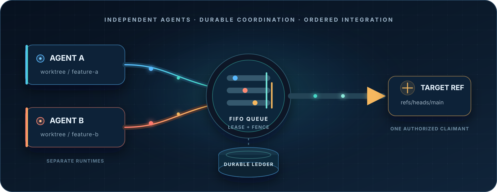
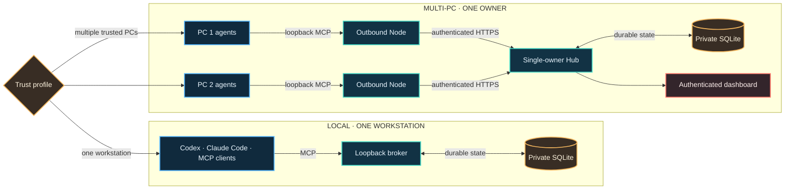
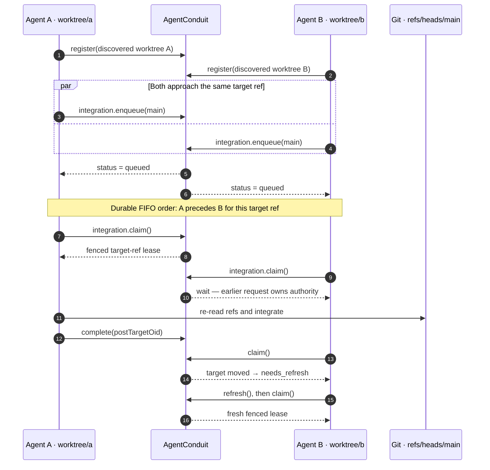
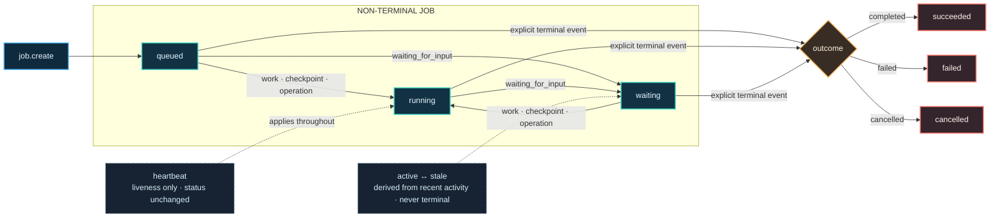
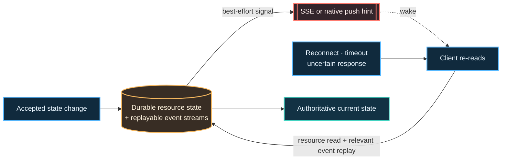

<div align="center">

# AgentConduit

**A durable coordination plane for independent coding agents sharing Git
work.**

[](https://github.com/aididhaiqal/AgentConduit/actions/workflows/ci.yml)
[](LICENSE)
[](docs/protocol.md)
[](docs/getting-started.md)
[](docs/operations.md)
[](docs/multi-pc-operations.md)

</div>

<p align="center">
  
</p>

AgentConduit gives Codex, Claude Code, and other MCP-capable runtimes one
provider-neutral place to discover each other, exchange durable messages,
report safe progress, and serialize work that must not race.

It is not another agent runtime. It is the meeting point between runtimes.

<table>
  <tr>
    <td align="center" width="25%">
      <strong>Discover</strong><br />
      <sub>Fresh peers in the same Git repository scope</sub>
    </td>
    <td align="center" width="25%">
      <strong>Communicate</strong><br />
      <sub>Durable messages, acknowledgements, and handoffs</sub>
    </td>
    <td align="center" width="25%">
      <strong>Observe</strong><br />
      <sub>Jobs, checkpoints, liveness, and terminal outcomes</sub>
    </td>
    <td align="center" width="25%">
      <strong>Integrate</strong><br />
      <sub>FIFO target queues with renewable fenced leases</sub>
    </td>
  </tr>
</table>

## Why this exists

The motivating failure was wonderfully ordinary: Claude and Codex were working
in separate Git worktrees, both finished at nearly the same time, and both tried
to merge.

Each runtime understood its own agents. Neither had a native way to coordinate
with the other. A chat message was too ephemeral, a process heartbeat did not
prove useful progress, and a timeout did not prove that abandoned work was safe
to discard. The result was a merge conflict that should have been prevented by
coordination rather than repaired afterward.

That small incident exposes a larger problem:

- provider-native agent messaging usually stops at the provider boundary;
- independent sessions cannot safely infer whether another session is active,
  stale, finished, or abandoned;
- Git branches and worktrees are real shared resources, but chat history is not
  a concurrency protocol;
- push notifications are useful wake-up hints, not durable evidence; and
- the same repository may be active on several trusted PCs without sharing
  local paths or process state.

AgentConduit makes those facts explicit and durable.

## The core promise

An agent can ask:

> Who else is working in this repository? What are they doing? Did they leave a
> durable message? Is this job merely alive, meaningfully progressing, waiting,
> or terminal? Who currently owns the right to integrate into this target ref?

And receive an answer that survives reconnects, process exits, UI switches, and
provider boundaries.

## What AgentConduit coordinates

| Signal                    | What it means                                                                                                                |
| ------------------------- | ---------------------------------------------------------------------------------------------------------------------------- |
| **Workspace identity**    | The Git repository, worktree, branch, HEAD, dirtiness, and upstream evidence observed by the machine that owns the workspace |
| **Agent presence**        | A registered runtime is online, stale, or offline; presence is liveness, never proof of completion                           |
| **Messages**              | Durable, acknowledged peer decisions and handoffs                                                                            |
| **Jobs**                  | Delegated, external, resumable, or long-running work with an explicit lifecycle                                              |
| **Job events**            | Bounded, normalized progress such as `working`, `checkpoint`, `waiting_for_input`, and terminal outcomes                     |
| **Integration authority** | A FIFO queue per target ref, renewable target leases, and fencing shared across compliant agents in one coordination scope   |
| **Audit cursors**         | Ordered replay after reconnects, uncertain responses, or push hints                                                          |

The coordination store is authoritative for those records and transitions.
AgentConduit does **not** proxy arbitrary Git commands or make raw Git impossible.
If bypass must be technically prevented, combine it with protected branches,
required review, or a remote merge queue.

## Architecture

AgentConduit supports two deliberately separate trust profiles. Local clients
never need a remote control plane; multi-PC clients still expose only a
loopback MCP boundary on each trusted machine.



On one workstation, every client talks to the same loopback broker and SQLite
database. Across PCs, every client still talks only to a loopback Node. Nodes
discover Git locally, redact absolute paths, and make outbound authenticated
connections to the Hub.

The Hub never opens a shell on a Node, never receives a workstation's absolute
path, and never executes Git.

## A merge race becomes an ordered handoff

Two agents may finish together. They do not need to guess who is faster, rely
on a chat window staying open, or treat a process heartbeat as merge authority.



AgentConduit authorizes the coordination transition; the claimant still runs
Git and reports the broker-visible post-operation target OID. A raw Git command
can bypass this advisory plane, so repositories that need hard enforcement
should also use protected branches, required review, or a remote merge queue.

## Designed for coordination, not surveillance

AgentConduit intentionally defines a smaller persistence boundary than an agent
platform might be tempted to keep. The protocol is not a place for:

- prompts;
- provider credentials;
- raw model streams;
- hidden reasoning;
- arbitrary shell output;
- customer records; or
- session secrets in messages, logs, URLs, or dashboard storage.

Clients must keep those values out of coordination fields; AgentConduit bounds
and validates the fields it accepts, but it cannot infer the meaning of every
caller-supplied summary.

Job events contain short operator-facing summaries and normalized state. A
`heartbeat` means recent liveness only. A `checkpoint` means useful bounded
progress. A stale job remains inspectable and resumable; staleness never
auto-completes, cancels, replaces, or grants cleanup authority.



| Observation                           | Safe conclusion                                                             |
| ------------------------------------- | --------------------------------------------------------------------------- |
| A recent `heartbeat`                  | The owner recently observed liveness                                        |
| A `checkpoint`                        | Useful bounded progress was recorded                                        |
| Derived activity becomes `stale`      | No recent activity was observed; inspect before acting                      |
| `succeeded`, `failed`, or `cancelled` | An explicit terminal event closed the lifecycle; no later event is accepted |

## Why durable reads and replay matter

Native push is excellent for responsiveness, but it is version-sensitive and
can be lost during disconnects. AgentConduit therefore uses a simple rule:

> Push wakes the client. Durable resource reads tell the truth.



Messages, jobs, progress events, leases, integrations, and audit records live in
SQLite. After a reconnect or uncertain response, clients re-read the
authoritative inbox, job, queue, lease, integration, and snapshot records.
Ordered job-event streams replay from each job's last durable cursor. Hub audit
and SSE cursors wake consumers and may require a fresh snapshot after a replay
reset; they never replace the underlying resource reads. Empty waits and
transport timeouts are observations, not lifecycle decisions.

## A typical cross-agent workflow

1. Each runtime registers from its actual Git worktree.
2. The broker or local Node discovers Git state instead of trusting a client
   assertion.
3. Agents discover fresh peers in the same repository scope.
4. They use durable messages for decisions and handoffs.
5. Long-running delegated work creates a job and emits normalized progress.
6. Before approaching a shared target ref, an agent enters the FIFO integration
   queue.
7. One claimant receives a renewable fenced lease; every other compliant agent
   waits or refreshes its Git evidence.
8. Completion, failure, cancellation, uncertainty, and stale ownership remain
   explicit and recoverable.

The shared
[`agentconduit-coordination` skill](skills/agentconduit-coordination/SKILL.md)
teaches supported runtimes when to use messages, jobs, leases, and replay. The
protocol stays the same for every provider.

## Quick start: one workstation

Requirements:

- Git;
- Node.js 22.20 or later; and
- pnpm 11.7.

Build from source:

```bash
git clone https://github.com/aididhaiqal/AgentConduit.git
cd AgentConduit
pnpm install --frozen-lockfile
pnpm build
```

Initialize one private broker with a narrow allowed root:

```bash
mkdir -p "$HOME/.config/agentconduit" "$HOME/.local/state/agentconduit"
chmod 700 "$HOME/.config/agentconduit" "$HOME/.local/state/agentconduit"

node apps/server/dist/main.js init \
  --config "$HOME/.config/agentconduit/config.json" \
  --data-dir "$HOME/.local/state/agentconduit" \
  --allowed-root "$HOME/code"

node apps/server/dist/main.js doctor \
  --config "$HOME/.config/agentconduit/config.json"

node apps/server/dist/main.js serve \
  --config "$HOME/.config/agentconduit/config.json"
```

The default MCP endpoint is `http://127.0.0.1:8787/mcp`. Keep the workstation
broker on numeric loopback; multi-PC operation uses the separate Hub and Node
profile.

Then:

- use the checked-in [Codex MCP example](examples/codex/config.toml) or
  [Claude Code MCP example](examples/claude/.mcp.json);
- expose the same coordination skill at the client's supported discovery path;
  and
- follow the [getting-started guide](docs/getting-started.md) for protected
  token loading, registration, a two-agent smoke test, stdio compatibility, and
  cross-clone project identity.

## Multi-PC operation

Independent clones do not join merely because their remote URLs match. Every
clone that should intentionally coordinate carries the same owner-approved
`.agentconduit/project.json`:

```json
{
  "projectId": "acme-payments"
}
```

The project ID is a coordination namespace, not authentication and not a
remote-ref lock. Each trusted PC runs one outbound Node; the Hub holds global
messages, jobs, integration authority, and the dashboard.

TLS, enrollment, service lifecycle, backup, restore, revocation, and recovery
are covered in the
[multi-PC operations runbook](docs/multi-pc-operations.md).

## Repository layout

| Path / package                                                          | Responsibility                                                                                                                |
| ----------------------------------------------------------------------- | ----------------------------------------------------------------------------------------------------------------------------- |
| [`packages/core`](packages/core/)                                       | Provider-neutral domain rules, Git discovery, SQLite persistence, messages, jobs, leases, queues, migrations, and maintenance |
| [`apps/server`](apps/server/)                                           | Production workstation MCP server and stdio compatibility bridge                                                              |
| [`packages/bridge`](packages/bridge/)                                   | Optional supervisor for a runtime process or thread explicitly owned by an adapter                                            |
| [`apps/hub`](apps/hub/)                                                 | Self-hosted single-owner authority and authenticated web dashboard                                                            |
| [`apps/node`](apps/node/)                                               | Outbound trusted-PC agent and loopback MCP endpoint                                                                           |
| [`skills/agentconduit-coordination`](skills/agentconduit-coordination/) | One provider-neutral Agent Skills package for Codex, Claude Code, and compatible clients                                      |

All six artifacts are independently packable. None has been published to npm
yet; source installation and future release gates are documented in the
[distribution guide](docs/distribution.md).

## Security boundaries

The default workstation profile is for mutually trusted agents running under
one operating-system account.

- Production serving binds to numeric loopback.
- Allowed roots limit which workspaces Git discovery may inspect.
- Git commands use fixed argument lists and canonicalized paths.
- Configuration, tokens, and SQLite state require private filesystem
  boundaries.
- State-changing operations are token-gated and retry-safe where practical.
- The multi-PC Hub accepts authenticated outbound Nodes rather than exposing
  the workstation broker remotely.
- Device revocation does not silently release uncertain leases or integration
  claims.

V1 is single-owner and trusts every enrolled PC. It is not a multi-user SaaS,
tenant boundary, RBAC system, remote shell, or hosted control plane.

Read the [security model](docs/security.md) and
[threat model](docs/threat-model.md) before exposing any service boundary.

## Project status

AgentConduit is a source-complete `0.1.0` foundation with retained tests across
the core, workstation server, bridge, Hub, Node, dashboard, migrations,
packaging, and the native Claude collaborator proof.

The important evidence distinctions remain explicit:

- the source is implemented, tested, built, packaged locally, and independently
  reviewed;
- selected disposable local Claude/Codex interoperability paths have been
  runtime-verified;
- npm packages have not been published;
- no operator workstation or multi-PC installation has been runtime-verified;
  and
- provider-native push and the native `claude_collaborator` path remain
  experimental and version-sensitive.

The canonical [progress ledger](docs/progress.md) records current test counts,
review outcomes, open obligations, and the difference between source,
publication, deployment, and runtime evidence.

## Documentation

| Start here                                         | Purpose                                                                               |
| -------------------------------------------------- | ------------------------------------------------------------------------------------- |
| [Getting started](docs/getting-started.md)         | Build, initialize, connect clients, install the shared skill, and verify coordination |
| [Workflow recipes](docs/workflow.md)               | Registration, messaging, jobs, queueing, integration, replay, and recovery            |
| [Protocol](docs/protocol.md)                       | MCP tools, state machines, authorization, pagination, and multi-PC parity             |
| [Workstation operations](docs/operations.md)       | Service lifecycle, doctor, backup, migration, maintenance, and recovery               |
| [Multi-PC operations](docs/multi-pc-operations.md) | Hub TLS, enrollment, Nodes, dashboard, backup/restore, and fail-closed recovery       |
| [Distribution](docs/distribution.md)               | Package contents, source installation, and public-release gates                       |
| [Security](docs/security.md)                       | Trust profiles, credential handling, Git boundaries, and residual risks               |

## License

AgentConduit is open source under the [MIT License](LICENSE).

## The idea in one line

**Let every agent keep its native strengths, but give all of them the same
durable coordination truth before they touch shared work.**
